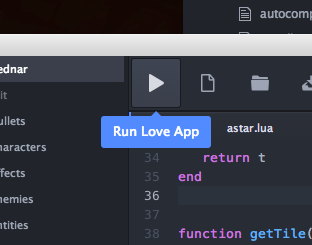

# love-ide
Utilities for writing Love2D games in Atom.

## Features
### Run Icon in Toolbar

### Autocomplete
### Auto-Install
This package automatically installs the following packages, which provide additional features:
  - [tool-bar](https://atom.io/packages/tool-bar)
  - [language-lua](https://atom.io/packages/language-lua)
  - [linter](https://atom.io/packages/linter)
  - [linter-luacheck](https://atom.io/packages/linter-luacheck)
  - [hyperclick](https://atom.io/packages/hyperclick)

## Contributing
```bash
# Clone the repo recursively, and cd in.
git clone --recursive https://github.com/rameshvarun/love-ide.git
cd love-ide

# Install all the dependencies.
npm install

# Symlink the package into ~/.atom/packages.
apm link
```

## TODO
- Jump-to-definition (via Hyperclick).
- Run Love Command.
- Hooks for various optional packages.
- Get Lua linting working.
- Some sort of Debug system?
