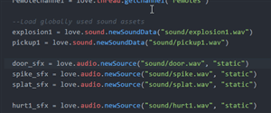

# love-ide

> This repository is now archived due the the [deprecation of Atom](https://github.blog/2022-06-08-sunsetting-atom/).

This package auto-installs several utilities for writing Love2D games in Atom. The individual packages can also be installed separately.

- [Features](#features)
  - [Run Icon in Toolbar](#run-icon-in-toolbar)
  - [Love API Autocomplete](#love-api-autocomplete-via-autocomplete-lovehttpsatomiopackagesautocomplete-love)
  - [Love API Click to Definition](#love-api-click-to-definition-via-hyperclick-lovehttpsatomiopackageshyperclick-love)
  - [Lua Syntax Checking](#lua-syntax-checking-via-linter-luaparsehttpsatomiopackageslinter-luaparse)
  - [GLSL Autocomplete](#glsl-autocomplete-via-autocomplete-glslhttpsatomiopackagesautocomplete-glsl)
- [Full Package List](#full-package-list)
- [Contributing](#contributing)

## Features
`love-ide` auto-installs packages that provide the following features.

### Run Icon in Toolbar


Runs `love .` in the project directory. As of now, this can't be installed separately.

### Love API Autocomplete (via [autocomplete-love](https://atom.io/packages/autocomplete-love))


Autocompletes snippets for calling methods and defining callbacks. Provides descriptions, as well as links to the wiki page.

### Love API Click to Definition (via [hyperclick-love](https://atom.io/packages/hyperclick-love))


Using cmd-click (Mac OSX) or alt-click (Windows), you can click on love functions, which opens up the corresponding Wiki page.

### Lua Syntax Checking (via [linter-luaparse](https://atom.io/packages/linter-luaparse))


Basic Lua syntax checking.

### GLSL Autocomplete (via [autocomplete-glsl](https://atom.io/packages/autocomplete-glsl))


Tools for writing vertex and fragment shaders.

## Full Package List
This package automatically installs the following packages (if not already installed).
  - [autocomplete-love](https://atom.io/packages/autocomplete-love)
  - [tool-bar](https://atom.io/packages/tool-bar)
  - [language-lua](https://atom.io/packages/language-lua)
  - [linter](https://atom.io/packages/linter)
  - [linter-luaparse](https://atom.io/packages/linter-luaparse)
  - [hyperclick](https://atom.io/packages/hyperclick)
  - [hyperclick-love](https://atom.io/packages/hyperclick-love)
  - [language-glsl](https://atom.io/packages/language-glsl)
  - [autocomplete-glsl](https://atom.io/packages/autocomplete-glsl)

## Contributing
```bash
apm dev love-ide
```
